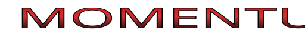

  

  <b>A PC port of <em>Super Smash Bros. Melee</em> (GameCube, 2001)</b> 
  <b>By Linifadomra</b> 
  With many thanks to the doldecomp decompilation team ❤️

  
  

> [!IMPORTANT]
> This repository does **not** contain any game assets or executable binaries. A legally obtained copy of the original game disc image is required. Linifadomra is not affiliated with, endorsed by, or sponsored by Nintendo Co., Ltd. Linifadomra ports are clean-room reimplementations and do not distribute Nintendo's original game assets or binaries.

---

## About

**Momentum** is a native, cross-platform PC port of *Super Smash Bros. Melee 4* (GameCube, 2001), built on top of the [Super Smash Bros. Melee decompilation](https://github.com/doldecomp/melee). The original game code runs natively on modern operating systems.

Rendering, input, audio, and ISO disc extraction are powered by [Rainfall](https://github.com/Linifadomra/Rainfall) and [Siphon](https://github.com/Linifadomra/Siphon).

---

## Supported

### Disc IDs

- `GALE01`: Rev 2 (USA) ✅

> [!NOTE]
> Other discs will eventually work (including Rev 0 USA), but for now, GALE01 is the disc being tested with.

### Platforms

* Windows (32-bit)
* Linux (32-bit)
